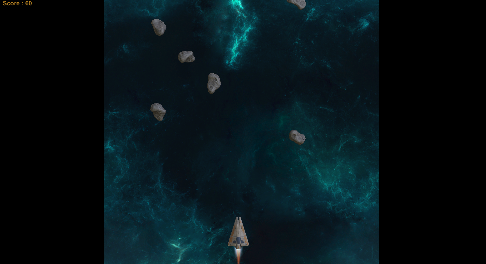
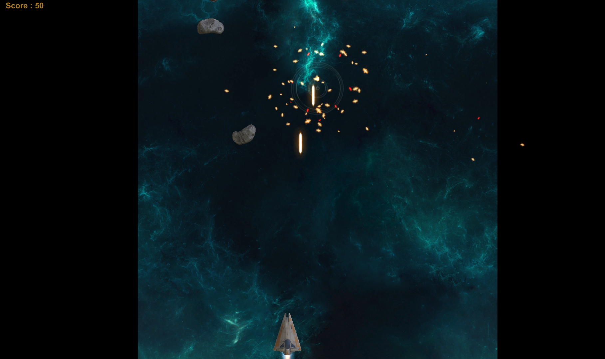
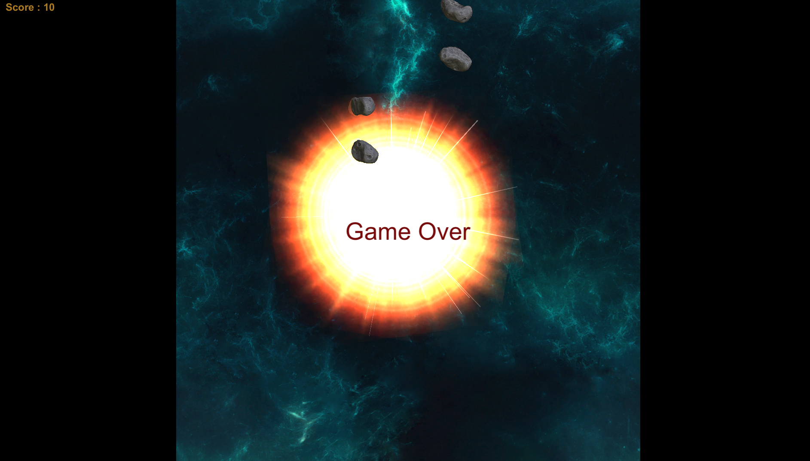
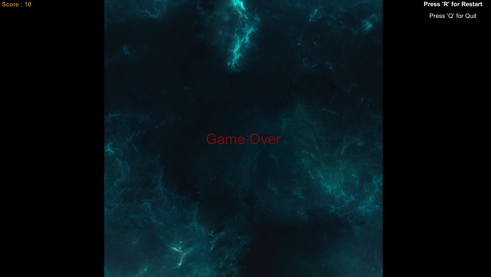

# Space-Shooter

## This game was created in C# using the Unity game engine.

### Installing

After downloading the files, you can try building the game using Unity. 

### Information

There is a small bug in the game. As soon as the game starts, the spaceship fires 1 time. You can fix it by checking the scripts.There are no levels in the game. However, every 10 meteors are given a cooldown for the player.

*The entrance of the game*

*Meteor explosion animation*

*Spaceship explosion animation*

*Exit and restart commands with Game Over screen*
